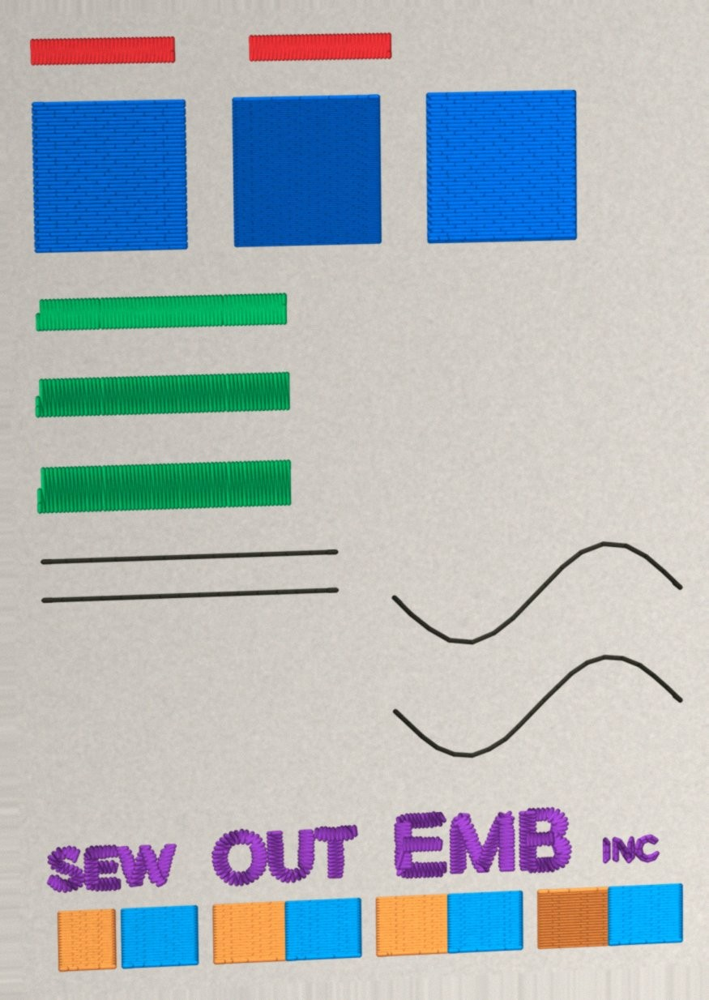
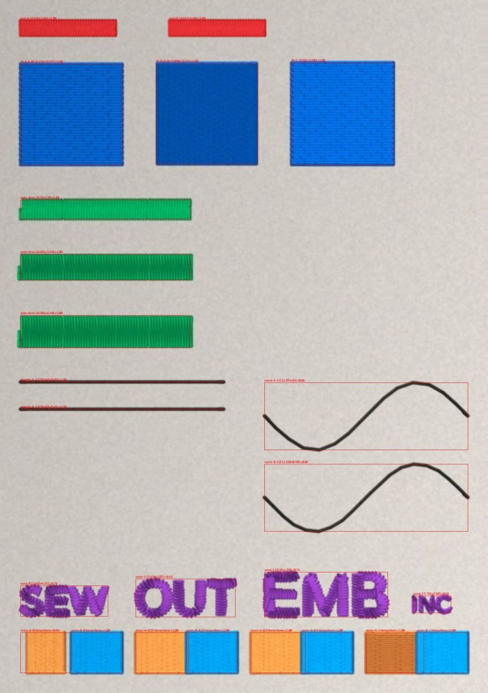

# Closed-loop sew-out calibration — decision brief

**Date:** 2026-09-30 · **Scope:** a decision brief for Kent on the one
capability no digitizing tool ships today, with a working probe behind it.
Grounded in `PRODUCT.md`, `ROADMAP.md`, the three Ember teardowns,
`docs/trade-knowledge-2026-09-13.md`, `docs/sewout-card-2026-07-31.md`,
`.claude/memory/first-physical-sewout-2026-09-01.md`, `digitizer_core/fabrics.py`
and `digitizer_core/preflight.py`. **No engine code changed.** What landed
beside this brief is an instrument, `digitizer/tools/sewout_reader.py`, and
its calibration, `digitizer/tests/test_sewout_reader.py`. Kent decides; this
brief takes a position (§9).

## 1. The proposition, in one paragraph

The customer sews a small test card on their own garment blank, photographs
it with a phone, and EMB-Bot reads the photo: how far each satin column
pulled in, how much cloth shows through each fill density, whether a seam
opened, which small lettering stayed legible, whether the lock held. From
that it writes a **profile for that machine, fabric, stabilizer and thread**,
and every later design is digitized against the profile. The preflight
report card the engine already produces stops being a generic grade and
becomes a prediction of how *this* machine will sew *this* file.

## 2. Why nobody has it, and why customers pay for it

- **Wilcom and Hatch** ship static fabric tables. Wilcom's own pull-comp page
  frames its numbers as "a guideline", names three variables (fabric,
  hooping tightness, object size) and does not say whether a value is per
  side or total (`trade-knowledge-2026-09-13.md` §4).
- **Ember** ships no fabric awareness at all — no pull comp, no per-fabric
  underlay, one density (`ember-competitive-teardown-2026-08-09.md` §2).
- **Every vendor's manual ends with "always test sew first."** That sentence
  is the manual version of this loop. None of them automates it.
- **The adjacent industries did, and it became the paid feature.** Bambu
  Lab's flow calibration print, Prusa's first-layer calibration, ICC printer
  profiling from a scanned target. Customers understand "print the test
  page, photograph it" instantly.
- **The complaint it answers is the top one against every auto-digitizer:**
  "looks fine on screen, sews badly" — puckering, gaps between fill and
  outline, thread breaks, stiff fills. It is the reason a home embroiderer
  still pays a human digitizer per design: the human knows how thread
  behaves on *their* goods. A tool that learns that from one test sew sells
  the same thing, once, on a subscription. Ember's live tier boundary
  (manual free, **automation paid**) is exactly where this sits.

## 3. Why this repo is the one that can build it

This turns the project's biggest structural weakness into its moat. Gate 1
refuses to move a physical constant without cloth because *"fabric settles
these, geometry cannot."* The vendor audit found there is no universal
constant to find. The customer's own cloth is the only authority, and this
feature makes the customer's cloth the authority.

| The loop needs | Already in the repo | Where |
|---|---|---|
| A test card that varies the gated constants on one hooping | **Built 2026-07-31, rebuilt 09-03.** 66 × 96 mm, 5,048 stitches, 7 blocks: lock length, fill density ×3, satin width ×3, travel step, small text ×4, seam underlap ×4 | `digitizer/tools/sewout_card.py`, `docs/sewout-card-2026-07-31.md` |
| A way to read the card off a photo | **Built today** — registration, thread/cloth split, per-feature extents, coverage, seam gap, OCR hook | `digitizer/tools/sewout_reader.py` |
| A picture of what the engine *intended*, to difference against | `stitchviz.render_design` — the reader runs the same code on the render and the photo, so filament width and anti-aliasing cancel | `digitizer_core/stitchviz.py` |
| Density instruments | `fill_pitch.py`, `row_pitch_union.py` (rows per mm from a stitch path) | `digitizer/tools/` |
| Legibility instrument | OCR on the render vs the artwork, already behind `LETTERING_ILLEGIBLE` | `digitizer_core/legibility.py` |
| A profile schema to fill | `Fabric`: `pull_comp_mm`, `density_adjust`, `fill_underlay`, `satin_underlay`, `trim_at_mm`, `assumed_backing`, `needs_topper` | `digitizer_core/fabrics.py`, `src/fabrics.js` |
| A report card to personalise | preflight grades A–F with about twenty named findings | `digitizer_core/preflight.py` |
| A local-first posture the photo does not break | analysis runs on the customer's machine; no upload | `PRODUCT.md` launch posture |

## 4. The customer flow

1. **Garment step.** Customer picks the goods (polo, cap, hoodie, towel) as
   today. A new button: *Calibrate for this fabric*.
2. **Download the card** for their hoop (see §7 on size) in their machine's
   format, with the worksheet the engine already prints: backing, topper,
   thread weight, sew order.
3. **Sew it on a blank of the same goods**, hooped the way they hoop.
4. **Photograph it** flat, square-on, in diffuse light, whole card in frame.
   Drop the photo on the Studio.
5. **Read the result.** The Studio shows the card with each block's reading
   and a draft profile: *"On this polo your satin pulls in 0.35 mm; 0.40 mm
   rows show cloth; the 4 mm text is legible, 2.5 mm is not; the 0.25 mm
   underlap seam held."* Customer accepts, and the profile becomes their
   fabric preset for that garment. Every later job digitizes and grades
   against it.

## 5. What each block measures, and which profile field it writes

| Card block | Photo reading | Profile field | Status of the read |
|---|---|---|---|
| 3 — wide satin at 3 / 4 / 5 mm | column height (pull-in across), length (push along) | `pull_comp_mm` (satin) | **read, calibrated** (§6) |
| 2 — fill at 0.40 / 0.20 / interleaved | square width (pull-in along rows), cloth show-through | `pull_comp_mm` (fill), `density_adjust` | width read and calibrated; **show-through reads but cannot be calibrated without cloth** — the render never thins a filament |
| 6 — seam underlap 0 / 0.25 / 0.5 / 1.0 | bare-cloth gap at each rung | stage 5 `overlap_mm` per fabric | **read, calibrated** to ~0.15 mm |
| 5 — text at 4 / 5 / 6 / 2.5 mm | OCR on the photo vs OCR on the render | smallest legible cap height → the Studio's warning floor | wired to tesseract, **unmeasured** (no tesseract on this box) |
| 1 — lock 0.8 vs 0.45 | bar box only | `TIE_STITCH_MM` | **not readable from a photo** — whether a lock held is a tug test. Stays Kent's eyes. |
| 4 — travel 2.5 vs 2.0 | not measured | `TRAVEL_STITCH_MM` | faceting is a look; stays Kent's eyes |

Two blocks stay human. That is fine: the loop is worth building for pull
comp, density and seams alone, which are the three things Kent's first
sew-out actually complained about (`first-physical-sewout-2026-09-01.md`).

## 6. The probe — what was built and what it measured

`digitizer/tools/sewout_reader.py` registers a photo onto the card's plan
frame at 20 px/mm, splits thread from cloth per feature by Lab distance from
the fabric colour with an Otsu cut (no colour constant), and measures each
bar's and square's sewn extents with sub-pixel edge crossings, each square's
coverage, each seam pair's bare gap, and each word's box (plus OCR when
tesseract exists). It then runs the **same code on the engine's own render**
of the card and reports the difference — the measurement is differential by
design, so nothing about filament width or anti-aliasing reaches the number.

Three registration modes, each honest about what it needs:

| Mode | Needs | Result on the simulation |
|---|---|---|
| `corners` | four clicked or fiducial-derived bbox corners | oracle path |
| `auto` | nothing — ink minAreaRect, then ECC against the plan's rendered ink | ECC correlation **0.99**; absorbs any GLOBAL shrink, so it sees local distortion only |
| `fiducials` | four sewn corner marks (proposed card change, §7) | registers off mark centroids, no artwork needed |

**No photo of a sewn card exists**, so the reader was calibrated the way
`fill_pitch.py` was: plant known distortions in the card's own design, fake
a phone photo (thread rendered on textured, unevenly lit cloth, perspective,
resample to phone resolution, blur, sensor noise, JPEG), and require the
reader to hand the distortions back. Two different distortion sets, because
recovering one value proves nothing.

**Measured 2026-09-30, simulated 12 px/mm phone photo** (a 12-megapixel
phone framing about a 30 cm field). Full table:
`docs/renders/sewout-reader-2026-09-30/sim_report_12pxmm.json`.

| Feature | Planted | Read (corners) | Read (auto) | Read (fiducials) |
|---|---:|---:|---:|---:|
| satin-4mm height (pull-in) | −0.30 | **−0.309** | −0.307 | −0.306 |
| satin-5mm height (pull-in) | −0.50 | **−0.502** | −0.501 | −0.501 |
| satin-4mm length (push) | +0.40 | 0.333 | 0.411 | 0.338 |
| fill-B width (pull-in along rows) | −0.40 | **−0.427** | −0.377 | −0.428 |
| seam-A-0 gap (2.0 mm shrink → ~0.6 mm bare) | ~0.60 | 0.45 | 0.45 | 0.45 |
| every untouched bar and square | 0 | within ±0.05 | within ±0.05 | within ±0.05 |

- **Across-column pull reads to 0.01 mm.** That is the number pull
  compensation is set from, and it is the one the reader is best at.
- **Along-row extents carry a ~0.05 mm systematic under-read** (row ends
  are scalloped filament caps; under blur they read narrower than the
  straight rail edge). It is the same in every mode and both directions of
  distortion, so it is a bias to calibrate out on cloth, not noise.
- **Seam gaps under-read by ~0.15 mm** at this resolution and 0.4 mm thread:
  the Otsu cut widens ink into a hairline gap. A 0.2 mm gap reads 0.0; a
  0.6 mm gap reads 0.45. Real cloth pulls of 0.4–0.6 mm per side open gaps
  the reader sees; hairlines it does not.
- **Degrades gracefully:** at 8 px/mm every figure above holds; at 6 px/mm
  (seed 11) the worst reading is 0.075 mm off. Below that is untested.
- Both test sets recover to their own values (`test_recovers_two_different_pulls`).

**What the simulation cannot say, stated so green is not read as settled:**
the simulator draws thread the way `stitchviz` draws it. Real cloth thins a
filament under tension, has nap, puckers, stretches in the hoop, and a
phone adds lens distortion and rolling-shutter skew. So the table is the
reader's floor on a *picture*. The cloth's floor is the first thing Kent's
photographs will measure, and it is the only number that matters for §9.

## 7. The catches

1. **Fiducials change the card — DONE the same day as card v2.** Four
   2.5 mm corner marks with a 1 mm gap, plus a fourth density square at the
   professional's 0.15 mm pitch (`sewout-findings-2026-09-03.md` §1), make
   the customer card **82 × 103 mm** — past a 4×4 hoop (100 × 100), inside
   5×7 (130 × 180) with 10 mm to spare. `tools/sewout_card_v2.py`; v1 is
   untouched for Kent's gate-1 work. `auto` mode still works without marks,
   at the cost of being blind to a global shrink. Six tests pin the card,
   including the reader registering off the marks on a simulated photo.
2. **A reading is not a constant** — gate 1 stands. The reader reports a
   *delta from the render*; turning that into `pull_comp_mm` for a
   customer's preset needs Kent's own card sewn and photographed first, to
   learn the cloth bias in §6, and a ruling on how a profile overrides the
   shipped `Fabric` table (per garment, additive, clamped).
3. **Show-through cannot be simulated.** `density_adjust` is the field with
   the least evidence behind it. The reader computes coverage; whether
   coverage from a phone photo tracks what Kent's eye calls "mesh" is an
   open question only his photos answer.
4. **Two blocks stay human** (lock, travel). The Studio flow needs a
   two-question form beside the photo, not a claim it read everything.
5. **Phone capture discipline.** Flat, square-on, diffuse light, no flash,
   whole card in frame. The simulator's 4% perspective is within what
   registration corrects; a card photographed at 30° is not tested.
6. **It is post-launch and Pro-tier.** Nothing here touches the launch
   checklist. It is a phase-5 item (*Inspection — sew-out*) on the roadmap,
   and it needs the billing decision before it can be gated.

## 8. Phased plan

| Phase | Work | Exit condition | Cost |
|---|---|---|---|
| **0 — Kent's photos** | Rebuild the card (fixed codec), sew on pique + cutaway, photograph per §7.5, get the photos in (`pull-corpus` skill; Drive, not git — a sew-out photo is not a fixture) | reader runs on a real photo in `auto` mode with ECC > 0.9 and every block found | one hooping, ten minutes of photos |
| **1 — cloth bias** | Compare reader deltas against Kent's own eyes and the row-pitch instruments on the same card; record the cloth bias per feature | the reader's satin pull-in agrees with a caliper on the sewn bar to 0.1 mm | a session |
| **2 — card v2** | **BUILT 2026-09-30** (`tools/sewout_card_v2.py`): fiducials, 5×7 fit, a 0.15 mm density arm, one colour per block; v1 untouched | v2 reads in `fiducials` mode on a REAL photo (simulated: yes) | a hooping |
| **3 — profile → engine** | A per-garment profile that ADJUSTS the `Fabric` preset within the machine's clamps (Kent's call, §10), DEFAULT OFF, byte-identical off, with the Studio's fabric row showing which is in force | a design digitized under a profile sews the profile's pull comp; `test_fabric_wire` guards both engines | a session |
| **4 — Studio flow** | The §4 buttons, the reading screen, the two human questions | a customer can calibrate without reading a doc | two sessions |
| **5 — tier** | Pro-gate it once billing exists | — | depends on the tabled billing decision |

Phases 0–1 cost Kent one hooping and settle the only question that matters.
Nothing past phase 1 should start before it.

## 9. Recommendation

**Do phase 0 now.** The reader is built, calibrated on pictures, and waiting
on the one input it cannot fake. One hooping of the existing card, sewn on
the polo blank the card's constants are tuned for, photographed the way §7.5
says, tells us whether a phone can read pull-in off cloth to a tenth of a
millimetre. If it can, this is the feature that no competitor has and that
turns gate 1 from a blocker into the product. If it cannot, we learn it for
the price of a hooping and the card still answers its original six
questions by eye.

The same hooping settles the sew-out card's own gate-1 questions (lock, row
pitch, satin ceiling, travel, text floor), which have been waiting since
2026-07-31. There is no cheaper experiment on this roadmap.

## 10. Decisions for Kent — three answered 2026-09-30

1. Sew and photograph the current card (phase 0)? — **Not yet; keep
   building.** Deferred, not declined. Every reader number stays a number
   about a picture until this happens.
2. Card v2's hoop target — **5×7.** Keeps every arm and adds fiducials;
   built the same day (§7.1). A 4×4-only customer cannot calibrate.
3. Profile *override* or *adjust*? — **Adjust, clamped.** A profile is a
   delta on the preset inside the machine's floors; a bad photo cannot take
   a preset below one. Recorded as a DOCTRINE standing ruling.
4. Is this Pro-tier, or the free hook that sells Pro? Ember charges for
   automation; a free calibration that then grades every design against
   the customer's own cloth may be the strongest upgrade prompt the
   product has. **Open.**

## Sources

- `PRODUCT.md`, `ROADMAP.md`, `DOCTRINE.md` standing rulings (2026-09-20 worksheet ruling, backing-class ruling)
- `docs/ember-competitive-teardown-2026-08-09.md`, `docs/emberdesign-competitive-research-2026-08-07.md`, `docs/scope/research-backlog.md`
- `docs/trade-knowledge-2026-09-13.md` §4–§6
- `docs/sewout-card-2026-07-31.md`, `docs/sewout-findings-2026-09-03.md`, `.claude/memory/first-physical-sewout-2026-09-01.md`
- `digitizer/tools/sewout_card.py`, `digitizer/tools/sewout_reader.py`, `digitizer/tests/test_sewout_reader.py`
- `digitizer_core/fabrics.py`, `preflight.py`, `stitchviz.py`, `legibility.py`
