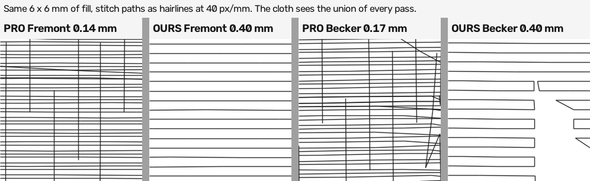

# The sew-out's five findings, checked against the record and re-measured — 2026-09-03

Kent, 2026-09-03: *"we need to start working on the general overall tool as
opposed to one specific logo … Logos can be used as a reference point when
comparing your digitized artwork to the professional's digitized artwork, but
we should be working on the overall tool."* He then passed on five findings
another Claude chat made from the macro photos of his sewn Instagram icon (the
2026-09-01 stitch-out, 6/10). This file checks each against what this repo had
already measured on the same sew-out, re-measures where the two disagree, and
ends with the tool-wide work each one implies.

The photos and the sewn DST are not in the repo (public; evidence custody in
`.claude/memory/first-physical-sewout-2026-09-01.md`). What IS measurable
here: the committed structural repro (`photo/repro_gradient_white_icon.png`),
the engine's own plans, and the professional's machine files in
`Embroidery Files.zip`.

## 1. "Fill coverage — the dominant visual problem; black fabric between every row; the gray reads as mesh"

**What the record said.** Contested. Reading A (0.18–0.19 mm pitch measured
from the sewn file) retired the density story; Reading B (a calibrated
per-pass estimator, now `tools/fill_pitch.py`) put the sewn file back at
0.400; then the first measurement of the professional's Becker files with
that instrument read **0.37–0.40 per pass**, and scope-history 2026-09-02
concluded *"these professional files do NOT support '0.40 is half
professional coverage'"*. What was never in dispute: seam trenches, raw
perimeter ends and late fragments also read as see-through.

**Re-measured today, as the cloth sees it.** `tools/row_pitch_union.py`
counts ROWS in the densest 8 mm of a field — the union of every pass, not a
period per pass:

| field | rows in 8 mm | adjacent-row pitch | rows/mm |
|---|---:|---:|---:|
| pro, Hotel Fremont patch ground (one pass) | 52 | **0.141 mm** | 6.7 |
| pro, Becker left-chest large, letter bodies | 47 | **0.169 mm** | 5.9 |
| pro, Becker chest small, letter bodies | 47 | **0.166 mm** | 6.0 |
| ours, Fremont ground fill | 20 | 0.400 mm | 2.6 |
| ours, Becker MARINE tatami | 20 | 0.400 mm | 2.6 |
| ours, icon repro, blend bands (union) | 21 | 0.400 mm | 2.6 |

The per-pass instrument over-reads a professional tatami: its
autocorrelation locks onto the split pattern's penetration cycle (every ~3
rows; 3 × 0.14 = 0.42), not the row pitch, so the 09-02 "0.37–0.40 per pass"
was that cycle. Read as rows, the Fremont ground is one pass 0.141 mm apart.
`test_row_pitch_union.py` pins the case that matters — two interleaved 0.40
passes offset 0.20 read 0.20 here and 0.40 per pass — and a synthetic split
tatami at 0.14 reads 0.14.

**Verdict.** The other chat is right about the mechanism, and by more than
Law 19 said: the professional lays **2.4–2.8×** our rows per millimetre, not
2×. The 09-02 conclusion is retracted below in scope-history. Gate 1 is
untouched — `FILL_ROW_MM` is still set by cloth — but the sew-out card's
block 2 (0.40 / 0.20 / two 0.40 passes offset 0.20) has no arm at the pro's
0.14–0.17; B and C both stop at 0.20.

**Tool-wide work.** Density is a physical setting, not a constant to hide:
a fabric-preset density with the professional's measured value as the
default, exposed in the Studio as light / standard / dense, and the two-pass
interleave built as an emission option so the card can choose between B and
C. `_underlay_paths` derives its lattice from `row_mm`, so pin it before
moving the row.

## 2. "Bare fabric gaps between adjacent color regions — no overlap, each region sewn to its exact boundary"

**What the record said.** Seam trenches between shade patches were the
first-named cause of see-through; borders-last shipped (PR #302), the quilt
cleanup is tabled (queue 12).

**What the engine does.** Stage 5 already underlaps: the colour that sews
FIRST extends `overlap_mm` = **0.25 mm** under the one that sews after, and
the later colour is forbidden to grow back over it (`stage5_overlap.py`). So
"no overlap" is wrong in the code and may still be right on cloth — 0.25 mm
against a 0.3 mm pique pull is thin. Two places have less: the blend tier's
shade bands overlap only by 2% of the ramp (`_BAND_OVERLAP_T`), and shapes
of the SAME thread get no seam logic at all (they merge if they touch).

**Verdict.** Mechanism exists, amount unproven; the sew-out card has no seam
block. **Tool-wide work:** a seam instrument (boundary length between
different-thread regions against underlap depth), a card block with abutting
fills at 0 / 0.25 / 0.5 / 1.0 mm underlap, and underlap between blend bands.

**Built the same day (Kent's ruling):** `tools/seam_underlap.py`, card block 6,
and blend-band underlap — scope-history 2026-09-03, "seams". What the
instrument found: the rule holds on the synthetic logos (0.525 mm) and falls
to **0.237 mm mean on Hotel Fremont**, because a hole stage 5 holds open at
its original size gets no tongue — the seams Kent saw are the seams around
small details, not a missing rule.

## 3. "The palette is wrong — gray, red, copper, mint for a magenta-to-orange gradient; likely defect 16"

**What the record said.** *"Sewn colours were random operator threading
(Kent-stated) — DST carries no palette; never grade colour from this out."*
Defect 16 (re-snap revisits) was RESOLVED 2026-08-31 and defect 18 fixed
2026-09-01 — both were about a spool sewing twice, not about which spools.

**Today.** The repro digitizes to 2521 Fuchsia, 0015 White, 1311 Date; the
Studio lists the threads to load.

**Verdict.** Not a file defect. The sewn colours were whatever was on the
machine. **Tool-wide work:** none in the engine; make sure the thread list is
unmissable at download.

## 4. "Region boundaries are blocky — axis-aligned rectangles stepping across a diagonal gradient; a pro follows the gradient's direction"

**What the record said.** The background sewed as a 7-cone shade-patch quilt
(defect 6 and 16 on cloth). Queue 12 (merging tiny cones) is tabled.

**Mechanism today.** The blend tier does follow the ramp — its bands are
clipped perpendicular to the ramp direction and its layers interleave at
`FILL_ROW_MM × n`. The blocks come from BEFORE it: the gradient lane
segments with SLIC superpixels (a grid), and a smooth ramp becomes a
staircase of near-square patches, each of which then gets its own bands.
The repro is a two-element icon and digitizes to **10 regions**.

**Verdict.** Right observation, mechanism is the superpixel split, not the
gradient decomposition. **Tool-wide work:** on a `gradient` design whose
whole-design ramp fits (`detect_design_ramp_angle` already answers this),
do not split a connected colour area into superpixels — one region, the
ramp bands do the decomposition. A routing change on the gradient lane,
so Kent's call.

**Built 2026-09-04 (Kent's ruling: "one region when the design ramp
fits").** `design_ramp.py` fits the sweep robustly (the plain fit above had
stopped applying at Studio defaults — the white icon sat in its population
and every channel read under the floor), stage 2 merges with the sweep
subtracted, and stage 6 sews every piece that rides it with ONE shade scheme
(and a riding piece never takes the satin rung — the outer strip had been
one-thread satin, fuchsia where the source turns orange). Repro at 80 mm:
10 → 8 regions, and the three ramp pieces (3,263, 1,055 and 621 mm²)
decompose into five shades along the diagonal where before they sewed flat
or as satin; 16,925 → 21,005 stitches, 3 → 5 colour blocks (Tulip, Fuchsia,
Devil Red, Sunset Orange, White). Two findings on the way that bear on item 1: the blend
bands had sewn at `FILL_ROW_MM × n` since the tier's first commit (one
sparse layer per band — the "mesh" on a gradient region was this, not only
the 0.40 row), and a linear ramp's band clip was anchored on the region's
own centre, leaving part of any off-centre region bare. Both fixed;
scope-history 2026-09-04.

## 5. "Untrimmed tails across the face; at minimum a trim/tie problem; check the machine's auto-trim"

**What the record said.** Tail jump-chains stepping 8–11.5 mm (a
sequencing symptom, reduced by borders-last and `start_near`), and "uncut
tail threads (operator cosmetic)".

**What the file does.** The plan trims every jump over 3.0 mm (repro: 18
jumps, 18 trimmed, none untrimmed over 3 mm), and we trim 3× MORE than the
professional (defect 4). DST has no trim opcode: pystitch writes a trim as
three consecutive jump records (`DstWriter.trim_at = 3`), which a machine
honours only if its trim-on-jumps setting matches.

**Verdict.** Agree with the other chat's own caveat: check the machine
first. If its auto-trim wants a different jump count, or reads PES, that
is a one-line export setting, not engine work. Thread ends left after a
trim are operator cosmetic.

## "The satin is the one thing that looks right"

Consistent with Law 19 — satin's spacing is a same-rail pitch and was never
2× light — and with the record's own reading of the photos.

## The tool-wide plan, in the order the evidence ranks it

1. **Density** (finding 1) — the largest visible gap, now measured at
   2.4–2.8× on the professional's files. Blocked on one thing: which
   density, and cloth decides. Card block 2 as written stops at 0.20; add an
   arm at the pro's 0.15, sew it, then set the preset. Engine work that
   needs no ruling: the density preset plumbing and the interleave option.
2. **Seams** (finding 2) — mechanism exists at 0.25 mm; needs an instrument
   and a card block before the number moves.
3. **Gradient decomposition** (finding 4) — stop superpixel-splitting a
   smooth ramp on the gradient lane; measurable on the repro (10 regions → 2).
4. **Trims** (finding 5) — a machine-setting question first.
5. **Palette** (finding 3) — no engine work.

None of this is one logo's fix; each is a stage-level behaviour every design
passes through.
